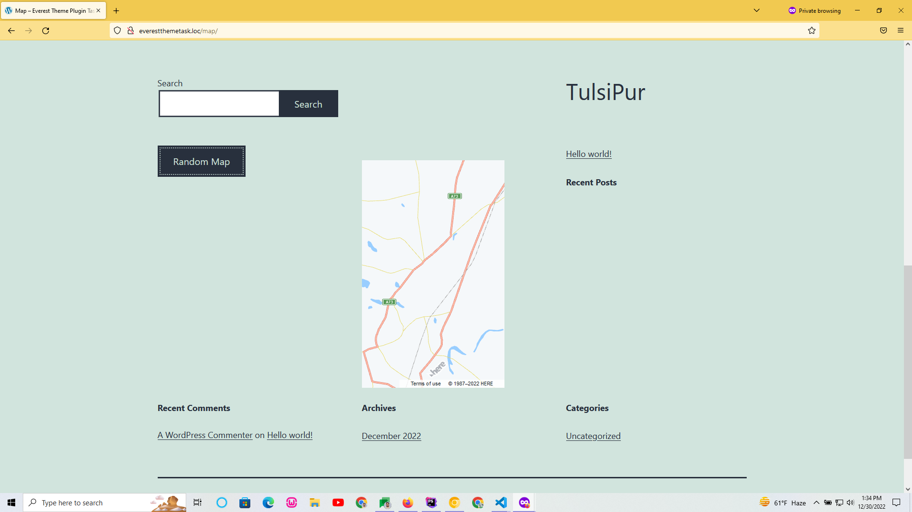
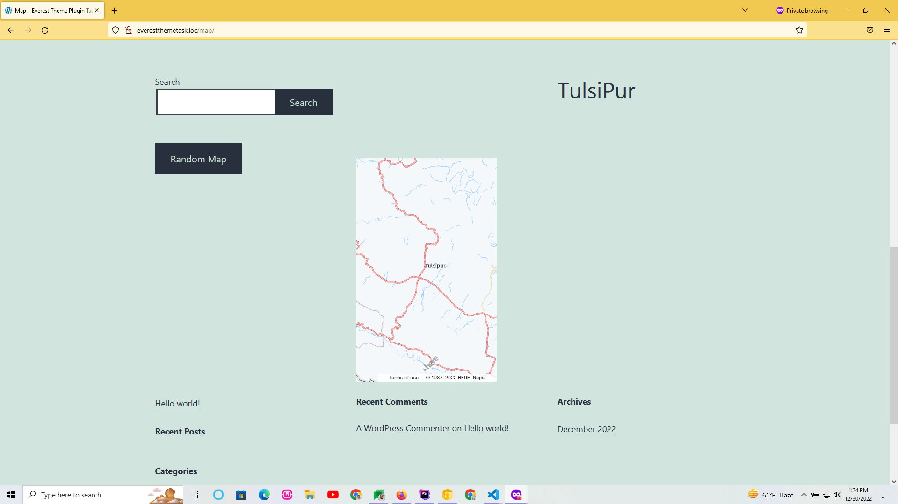

<h2>Map Plugin</h2>

<h4>Features</h4>
1) Generate shortcode to view the map in frontend of the website
2) Generate widget to show the map

<h5>Screenshots</h5>

<h5>Demo Video Link:</h5>

https://drive.google.com/file/d/1YHTu1Oaw1cc2pSnymanrDSz7zynlYUUX/view?usp=sharing

